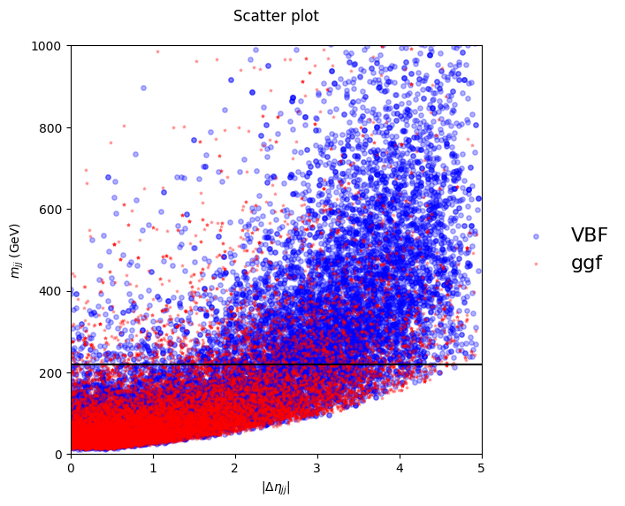
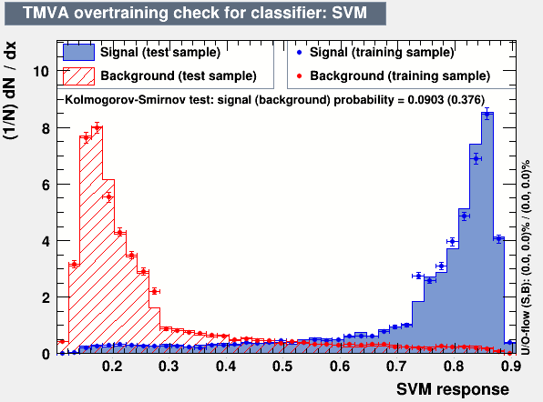
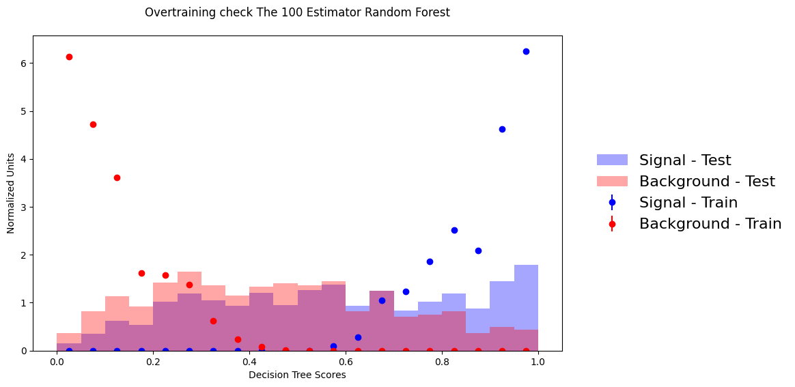
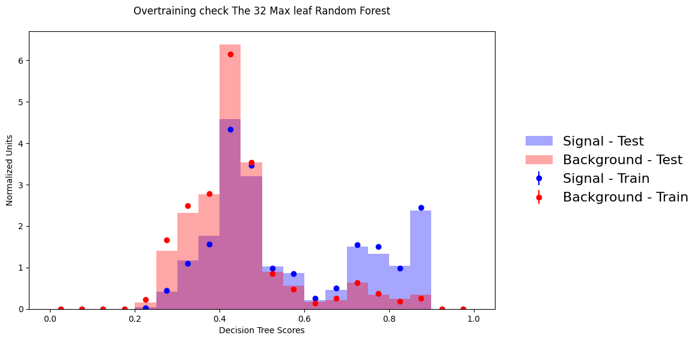

# Machine Learning Project: Decision Stump and Overtraining Check

## Abstract
This project explores binary classification methods using decision stumps and decision trees, focusing on their performance, overtraining tendencies, and generalization capabilities. Key objectives include calculating the Gini index, determining optimal thresholds for decision stumps, and evaluating classifiers with overtraining checks. The report includes six visual placeholders for the corresponding plots and charts.

---

## Table of Contents
1. Introduction
2. Methodology
   - Dataset Description
   - Decision Stump Implementation
   - Overtraining Check
3. Results and Analysis
   - Decision Stump Performance
   - Overtraining Check with Decision Tree
   - Overtraining Check with Random Forest
4. Visual Analysis
5. Conclusion

---

## 1. Introduction
This report investigates the performance of decision stumps and evaluates overtraining in decision tree-based classifiers. The study leverages datasets containing signal and background samples and uses metrics like Gini index and cost functions for model evaluation. A key focus is understanding the generalization ability of models on unseen data.

---

## 2. Methodology

### Dataset Description
The project uses two datasets:
1. **Training Data**: Features include Δηjj (detajj) and mjj (massjj) for binary classification.
2. **Testing Data**: Similar structure as the training dataset for validation.

**Global Variables:**
- Features: `detajj`, `massjj`
- Target: `sample`
- Range for detajj: [0, 5] with step 0.1
- Range for massjj: [0, 1000] with step 10

### Decision Stump Implementation
1. **Gini Index Calculation:**
   - A function computes the Gini index for a given feature to evaluate data impurity.

2. **Cost Calculation:**
   - A function computes the cost of splitting data based on thresholds.

3. **Optimal Threshold Determination:**
   - The best threshold for feature splits is determined by minimizing cost.

4. **Visualization of Cuts:**
   - Scatter plots with optimal threshold lines are generated.

### Overtraining Check
Two classifiers were evaluated:
1. **Decision Tree (max depth=2):** A simple classifier for initial testing.
2. **Random Forest (with default and optimized parameters):** Evaluated with 100 estimators and max leaf nodes.

For both classifiers, histograms and error bars illustrate the distribution of predictions for training and testing datasets.

---

## 3. Results and Analysis

### Decision Stump Performance
The optimal decision stump was determined using the massjj feature with a threshold of 220 GeV, achieving the lowest Gini index and cost. Results indicate effective separation between signal and background samples.

### Overtraining Check with Decision Tree
The overtraining check demonstrates that the decision tree generalizes well, showing consistent performance between training and testing sets. Minimal overfitting was observed.

### Overtraining Check with Random Forest
1. **Default Parameters:**
   - Extreme overfitting was observed, with excellent training set performance but poor generalization on the test set.

2. **Optimized Parameters (max leaf nodes=32):**
   - Significant improvement in generalization with reduced overfitting.

---

## 4. Visual Analysis

### Visual 1: Scatter Plot for Decision Stump Cut

- **Description:** This plot illustrates the scatter distribution of the `detajj` and `massjj` features with the optimal decision stump cut line overlayed.
- **Analysis:** The threshold of 220 GeV effectively separates signal and background, as evident from the clustering of points on either side of the cut.

### Visual 2: Overtraining Check for Decision Tree

- **Description:** This plot shows the predicted probabilities for the decision tree classifier (max depth=2) for both training and testing datasets.
- **Analysis:** The classifier exhibits good generalization, with overlapping distributions for training and testing, indicating minimal overfitting.

### Visual 3: Overtraining Check for Random Forest (Default)

- **Description:** This histogram and error plot display the performance of a random forest classifier with 100 estimators and default parameters.
- **Analysis:** The model severely overfits, as evidenced by a sharp disparity between the training and testing set performance. The test set predictions lack meaningful separation.

### Visual 4: Overtraining Check for Random Forest (Optimized)

- **Description:** Similar to Visual 3 but with a random forest constrained to a maximum of 32 leaf nodes.
- **Analysis:** The optimized parameters significantly reduce overfitting, with improved consistency between training and testing performance and better generalization.

---

## 5. Conclusion
The project demonstrated the effectiveness of decision stumps for feature separation and highlighted the importance of optimizing model hyperparameters to prevent overfitting. Random forests with constrained complexity showed superior generalization, emphasizing the need for balanced training strategies in machine learning workflows.

---

## Appendix
The project utilized Python libraries such as NumPy, Pandas, Matplotlib, and Scikit-learn. For full code and implementation details, refer to the accompanying notebook.

Creadits : Claire David
